```{r setup, include=FALSE}
knitr::opts_chunk$set(
  echo = FALSE,
  warning = FALSE,
  message = FALSE
)
```

<style>
html, body {
  margin: 0;
  padding: 0;
  background: #eef3f8;
  font-family: Arial, Helvetica, sans-serif;
  color: #172b4d;
}
.main-container {
  max-width: 1600px;
  width: 97%;
  margin: 12px auto;
  padding: 0;
}
.dashboard-header {
  display: grid;
  grid-template-columns: 180px 1fr 245px;
  align-items: center;
  background: white;
  border-radius: 9px;
  padding: 12px 24px;
  box-shadow: 0 1px 6px rgba(0,0,0,.12);
  margin-bottom: 10px;
}
.logo-box {
  display: flex;
  align-items: center;
  justify-content: center;
}
.moh-logo {
  max-height: 100px;
  max-width: 155px;
  object-fit: contain;
}
.who-logo {
  max-height: 90px;
  max-width: 230px;
  object-fit: contain;
}
.header-centre {
  text-align: center;
  padding: 0 12px;
}
.dashboard-title {
  font-size: 29px;
  line-height: 1.15;
  font-weight: 700;
  color: #17365D;
  margin-bottom: 7px;
}
.dashboard-period {
  font-size: 14px;
  color: #52657a;
}
.navigation {
  display: flex;
  flex-wrap: wrap;
  background: #17365D;
  border-radius: 7px;
  overflow: hidden;
  margin-bottom: 12px;
}
.tab-button {
  flex: 1;
  min-width: 145px;
  border: none;
  background: #17365D;
  color: white;
  padding: 13px 12px;
  cursor: pointer;
  font-size: 13px;
  font-weight: 600;
}
.tab-button:hover {
  background: #255a91;
}
.tab-button.active {
  background: #0072BC;
}
.tab-content {
  display: none;
}
.tab-content.active {
  display: block;
}
.kpi-grid {
  display: grid;
  grid-template-columns: repeat(6, 1fr);
  gap: 10px;
  margin-bottom: 12px;
}
.kpi-card {
  background: white;
  border-radius: 7px;
  padding: 14px 8px;
  text-align: center;
  border-top: 4px solid #0072BC;
  box-shadow: 0 1px 4px rgba(0,0,0,.10);
}
.kpi-label {
  font-size: 11px;
  font-weight: 600;
  color: #5b677a;
  min-height: 30px;
  display: flex;
  align-items: center;
  justify-content: center;
}
.kpi-value {
  color: #17365D;
  font-size: 24px;
  font-weight: 700;
  margin-top: 4px;
}
.kpi-small {
  color: #64748b;
  font-size: 11px;
  margin-top: 2px;
}
.section-title {
  font-size: 20px;
  font-weight: 700;
  color: #17365D;
  margin: 14px 2px 9px 2px;
}
.section-note {
  font-size: 12px;
  color: #64748b;
  margin: -5px 2px 10px 2px;
}
.chart-grid {
  display: grid;
  grid-template-columns: 1fr 1fr;
  gap: 12px;
}
.chart-card {
  background: white;
  border-radius: 7px;
  padding: 12px;
  box-shadow: 0 1px 4px rgba(0,0,0,.10);
  margin-bottom: 12px;
}
.full-width {
  width: auto;
}
.chart-heading-row {
  display: flex;
  justify-content: space-between;
  align-items: flex-start;
  gap: 10px;
  margin-bottom: 5px;
}
.chart-title {
  font-size: 16px;
  font-weight: 700;
  color: #17365D;
}
.chart-subtitle {
  font-size: 11px;
  color: #697386;
  margin-top: 3px;
}
.dashboard-chart {
  width: 100%;
  height: auto;
  display: block;
}
.download-btn {
  display: inline-block;
  background: #0072BC;
  color: white !important;
  padding: 7px 12px;
  border-radius: 5px;
  text-decoration: none !important;
  font-size: 11px;
  font-weight: 700;
  white-space: nowrap;
}
.download-btn:hover {
  background: #005a96;
}
.table-card {
  background: white;
  border-radius: 7px;
  padding: 14px;
  margin-bottom: 13px;
  box-shadow: 0 1px 4px rgba(0,0,0,.10);
}
.table-heading {
  display: flex;
  justify-content: space-between;
  align-items: center;
  gap: 10px;
  margin-bottom: 10px;
}
.footer {
  margin-top: 14px;
  padding: 12px;
  background: white;
  border-radius: 7px;
  text-align: center;
  font-size: 10px;
  color: #64748b;
}
@media(max-width:1200px) {
  .kpi-grid {
    grid-template-columns: repeat(3,1fr);
  }
  .dashboard-header {
    grid-template-columns: 140px 1fr 200px;
  }
}
@media(max-width:850px) {
  .chart-grid {
    grid-template-columns: 1fr;
  }
  .kpi-grid {
    grid-template-columns: repeat(2,1fr);
  }
  .dashboard-header {
    grid-template-columns: 1fr;
    gap: 10px;
  }
  .dashboard-title {
    font-size: 23px;
  }
}
</style>

<div class="dashboard-header">
<div class="logo-box">

</div>
<div class="header-centre">
<div class="dashboard-title">
South Sudan IDSR Reporting Performance Dashboard
</div>
<div class="dashboard-period">Epidemiological Weeks 1–30, 2026 &nbsp; | &nbsp; National Reporting Target ≥80%</div>
</div>
<div class="logo-box">

</div>
</div>

<div class="navigation">
<button class="tab-button active" 
onclick="openTab(event, 'overview')">
Overview
</button>
<button class="tab-button" 
onclick="openTab(event, 'national')">
National Trends
</button>
<button class="tab-button" 
onclick="openTab(event, 'states')">
State/AA Performance
</button>
<button class="tab-button" 
onclick="openTab(event, 'monthly')">
Monthly Performance
</button>
<button class="tab-button" 
onclick="openTab(event, 'historical')">
Historical Performance
</button>
<button class="tab-button" 
onclick="openTab(event, 'management')">
Management & Tables
</button>
</div>

<div id="overview" class="tab-content active">
<div class="kpi-grid">
<div class="kpi-card"><div class="kpi-label">National Timeliness — Latest Week</div><div class="kpi-value">81%</div></div>
<div class="kpi-card"><div class="kpi-label">National Completeness — Latest Week</div><div class="kpi-value">85%</div></div>
<div class="kpi-card"><div class="kpi-label">Health Facilities Reporting</div><div class="kpi-value">986/1166</div><div class="kpi-small">84.6% reporting</div></div>
<div class="kpi-card"><div class="kpi-label">States/AA Meeting Timeliness Target</div><div class="kpi-value">9/13</div></div>
<div class="kpi-card"><div class="kpi-label">States/AA Meeting Completeness Target</div><div class="kpi-value">9/13</div></div>
<div class="kpi-card"><div class="kpi-label">High-Priority States/AA</div><div class="kpi-value">3</div></div>
</div>
<div class="section-title">
Management Overview
</div>
<div class="chart-grid">
<div class="chart-card"><div class="chart-heading-row"><div><div class="chart-title">National Reporting Trend</div><div class="chart-subtitle">Weekly national timeliness and completeness performance.</div></div><a class="download-btn" href="Downloads/National_Combined_Trend.png" download="National_Combined_Trend.png">Download PNG</a></div>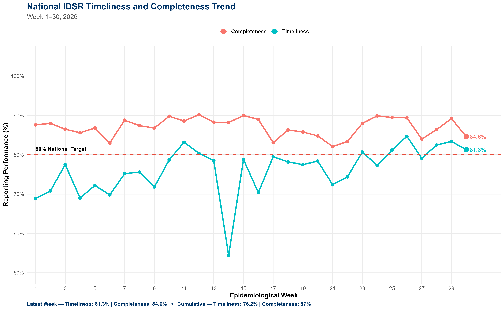</div>
<div class="chart-card"><div class="chart-heading-row"><div><div class="chart-title">Current State/AA Performance</div><div class="chart-subtitle">Latest timeliness and completeness performance across State/AA.</div></div><a class="download-btn" href="Downloads/State_Indicator_Comparison.png" download="State_Indicator_Comparison.png">Download PNG</a></div>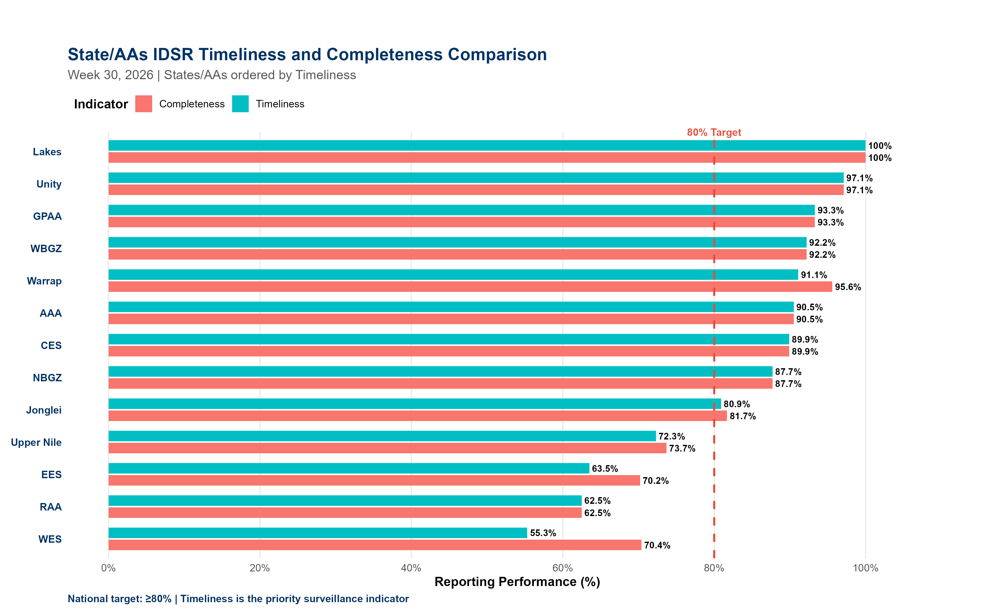</div>
</div>
<div class="chart-card full-width"><div class="chart-heading-row"><div><div class="chart-title">State/AA Management Priority</div><div class="chart-subtitle">Current reporting status combined with historical reporting consistency.</div></div><a class="download-btn" href="Downloads/State_Management_Priority.png" download="State_Management_Priority.png">Download PNG</a></div>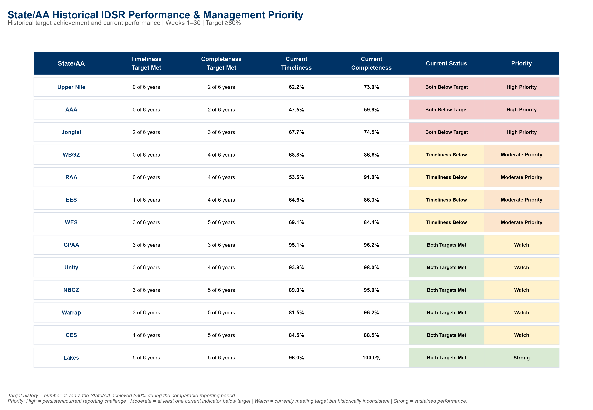</div>
</div>
<div id="national" class="tab-content">
<div class="section-title">
National Reporting Trends
</div>
<div class="section-note">
National timeliness and completeness trends, changes and year-on-year comparisons.
</div>
<div class="chart-grid">
<div class="chart-card"><div class="chart-heading-row"><div><div class="chart-title">National Timeliness Trend</div><div class="chart-subtitle">Weekly national IDSR reporting timeliness.</div></div><a class="download-btn" href="Downloads/National_Timeliness_Trend.png" download="National_Timeliness_Trend.png">Download PNG</a></div>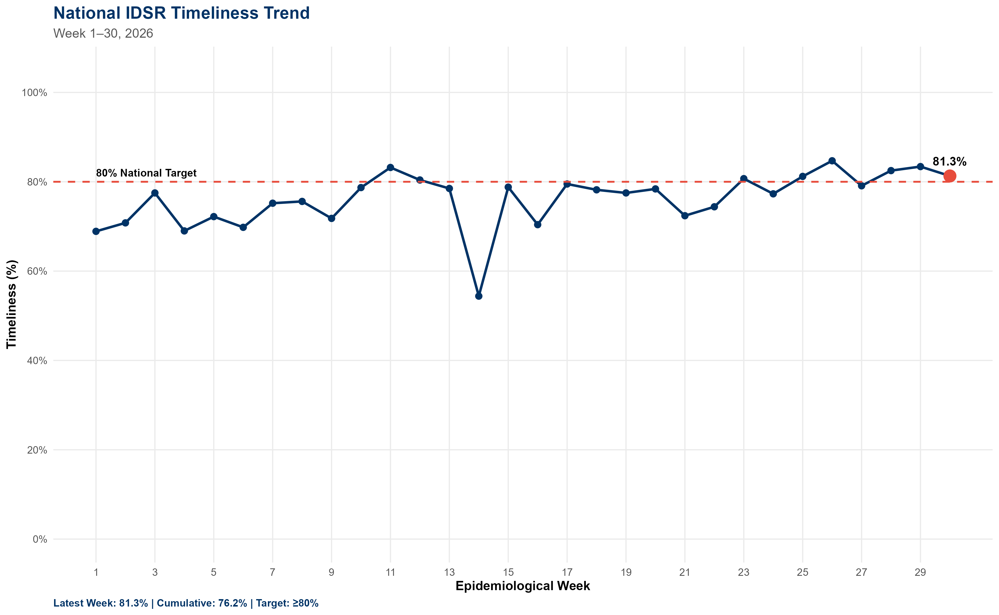</div>
<div class="chart-card"><div class="chart-heading-row"><div><div class="chart-title">National Completeness Trend</div><div class="chart-subtitle">Weekly national IDSR reporting completeness.</div></div><a class="download-btn" href="Downloads/National_Completeness_Trend.png" download="National_Completeness_Trend.png">Download PNG</a></div>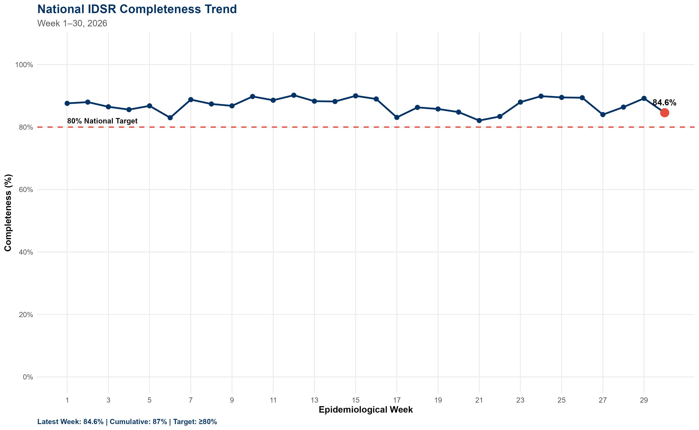</div>
<div class="chart-card"><div class="chart-heading-row"><div><div class="chart-title">Combined National Trend</div><div class="chart-subtitle">Timeliness and completeness displayed together.</div></div><a class="download-btn" href="Downloads/National_Combined_Trend.png" download="National_Combined_Trend.png">Download PNG</a></div></div>
<div class="chart-card"><div class="chart-heading-row"><div><div class="chart-title">National Monthly Performance</div><div class="chart-subtitle">Monthly national reporting performance.</div></div><a class="download-btn" href="Downloads/National_Monthly_Performance.png" download="National_Monthly_Performance.png">Download PNG</a></div>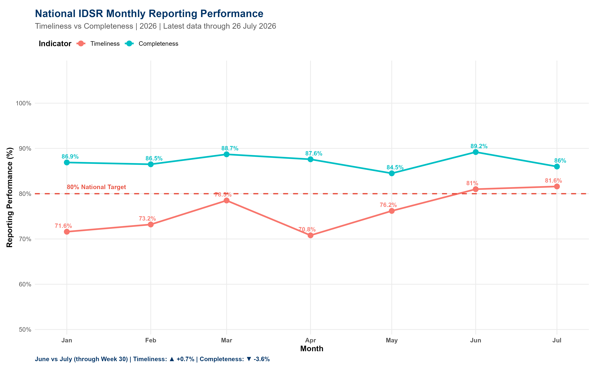</div>
<div class="chart-card"><div class="chart-heading-row"><div><div class="chart-title">Weekly Timeliness — Year-on-Year</div><div class="chart-subtitle">Weekly timeliness compared across reporting years.</div></div><a class="download-btn" href="Downloads/Weekly_Timeliness_YoY.png" download="Weekly_Timeliness_YoY.png">Download PNG</a></div>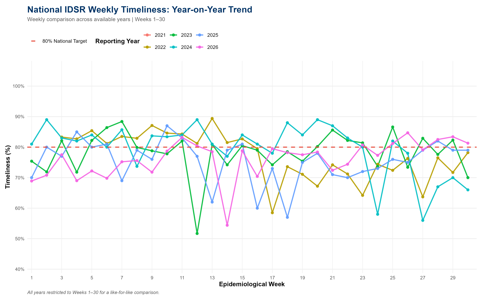</div>
<div class="chart-card"><div class="chart-heading-row"><div><div class="chart-title">Weekly Completeness — Year-on-Year</div><div class="chart-subtitle">Weekly completeness compared across reporting years.</div></div><a class="download-btn" href="Downloads/Weekly_Completeness_YoY.png" download="Weekly_Completeness_YoY.png">Download PNG</a></div>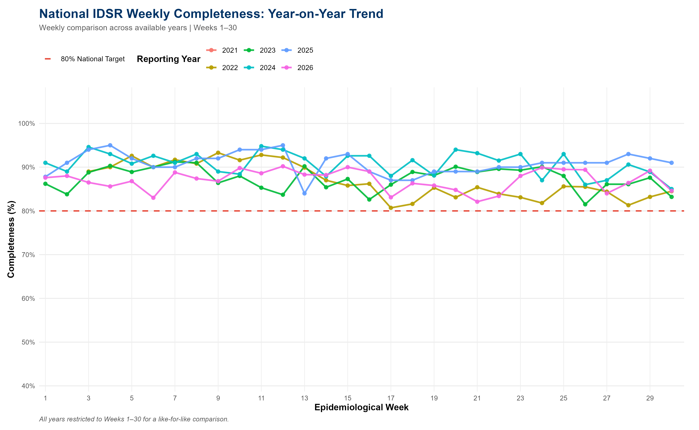</div>
</div>
<div class="section-title">
Recent Change
</div>
<div class="chart-grid">
<div class="chart-card"><div class="chart-heading-row"><div><div class="chart-title">Timeliness Weekly Change</div><div class="chart-subtitle">Change in timeliness from the previous reporting week.</div></div><a class="download-btn" href="Downloads/Timeliness_Weekly_Change.png" download="Timeliness_Weekly_Change.png">Download PNG</a></div>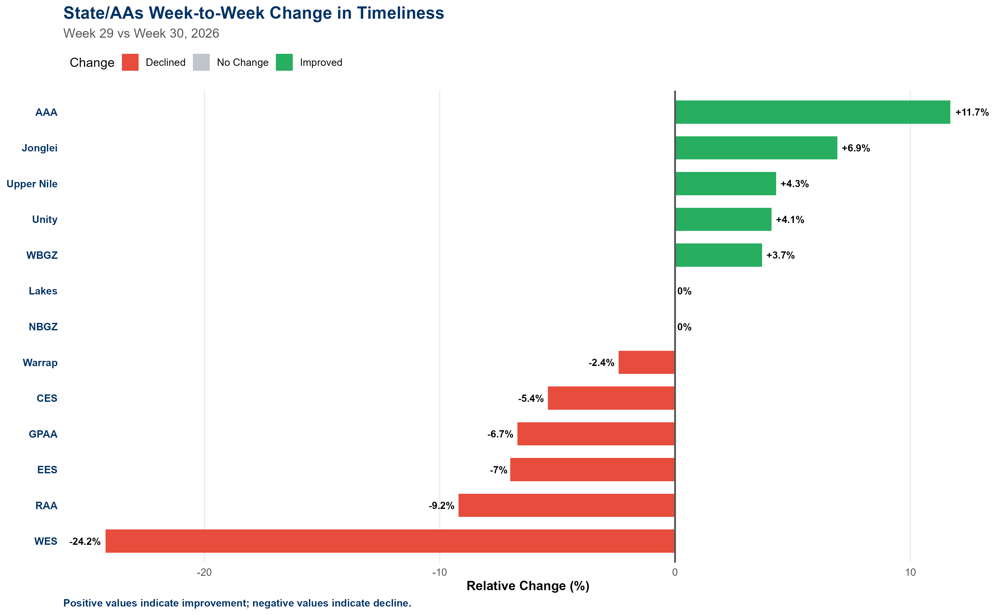</div>
<div class="chart-card"><div class="chart-heading-row"><div><div class="chart-title">Completeness Weekly Change</div><div class="chart-subtitle">Change in completeness from the previous reporting week.</div></div><a class="download-btn" href="Downloads/Completeness_Weekly_Change.png" download="Completeness_Weekly_Change.png">Download PNG</a></div>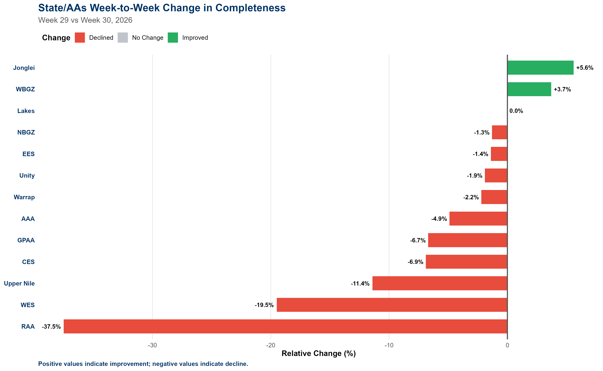</div>
</div>
<div class="chart-card full-width"><div class="chart-heading-row"><div><div class="chart-title">Combined Weekly Change</div><div class="chart-subtitle">Combined change in national timeliness and completeness.</div></div><a class="download-btn" href="Downloads/Combined_Weekly_Change.png" download="Combined_Weekly_Change.png">Download PNG</a></div>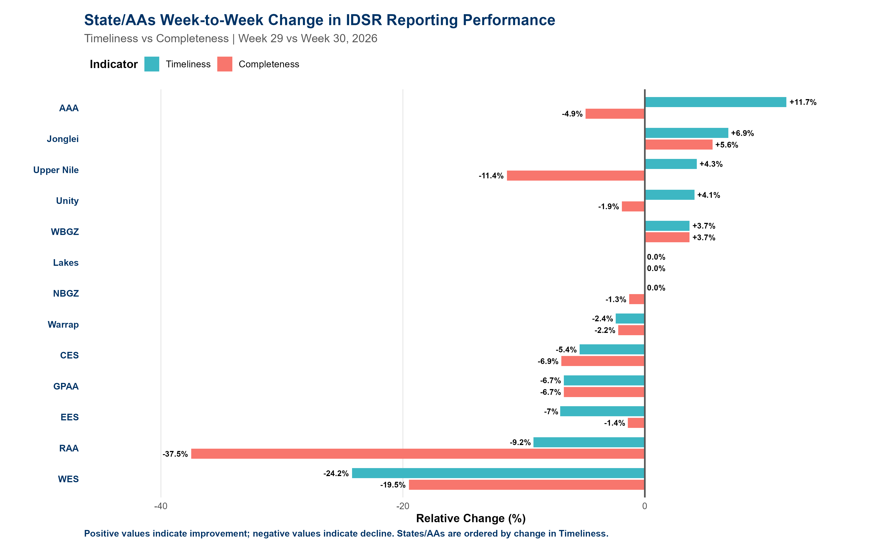</div>
</div>
<div id="states" class="tab-content">
<div class="section-title">
Current State/AA Performance
</div>
<div class="chart-grid">
<div class="chart-card"><div class="chart-heading-row"><div><div class="chart-title">State/AA Timeliness</div><div class="chart-subtitle">Current State/AA reporting timeliness.</div></div><a class="download-btn" href="Downloads/State_Timeliness.png" download="State_Timeliness.png">Download PNG</a></div>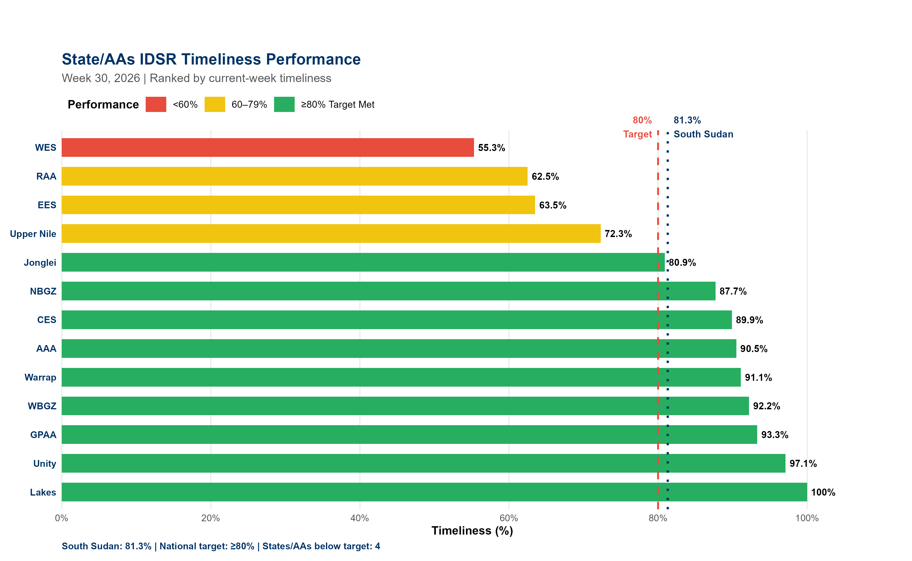</div>
<div class="chart-card"><div class="chart-heading-row"><div><div class="chart-title">State/AA Completeness</div><div class="chart-subtitle">Current State/AA reporting completeness.</div></div><a class="download-btn" href="Downloads/State_Completeness.png" download="State_Completeness.png">Download PNG</a></div>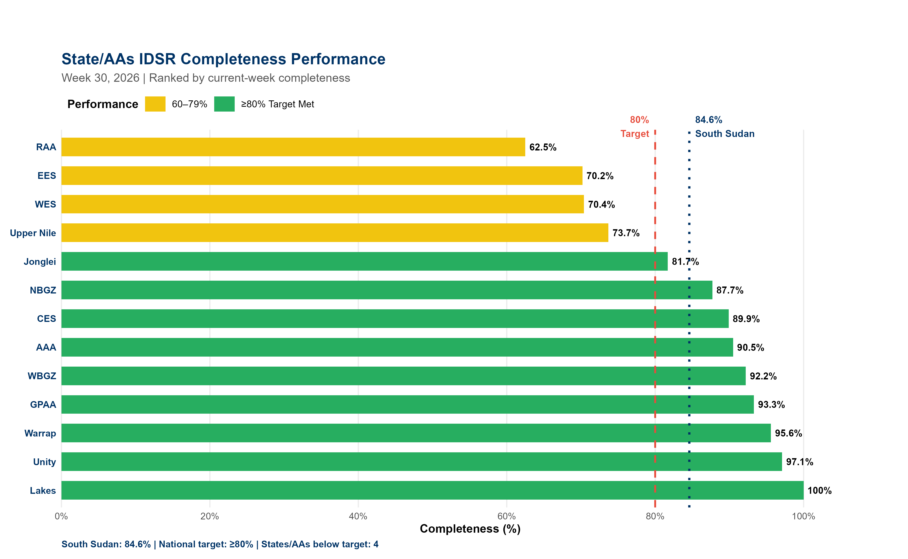</div>
</div>
<div class="chart-card full-width"><div class="chart-heading-row"><div><div class="chart-title">State/AA Indicator Comparison</div><div class="chart-subtitle">Timeliness and completeness compared against the national reporting target.</div></div><a class="download-btn" href="Downloads/State_Indicator_Comparison.png" download="State_Indicator_Comparison.png">Download PNG</a></div></div>
<div class="section-title">
Year-on-Year State/AA Performance
</div>
<div class="section-note">
Like-for-like comparison using the same epidemiological-week period.
</div>
<div class="chart-grid">
<div class="chart-card"><div class="chart-heading-row"><div><div class="chart-title">State/AA Timeliness — Year-on-Year</div><div class="chart-subtitle">Current reporting year compared with the same period of the previous year.</div></div><a class="download-btn" href="Downloads/State_YoY_Timeliness.png" download="State_YoY_Timeliness.png">Download PNG</a></div>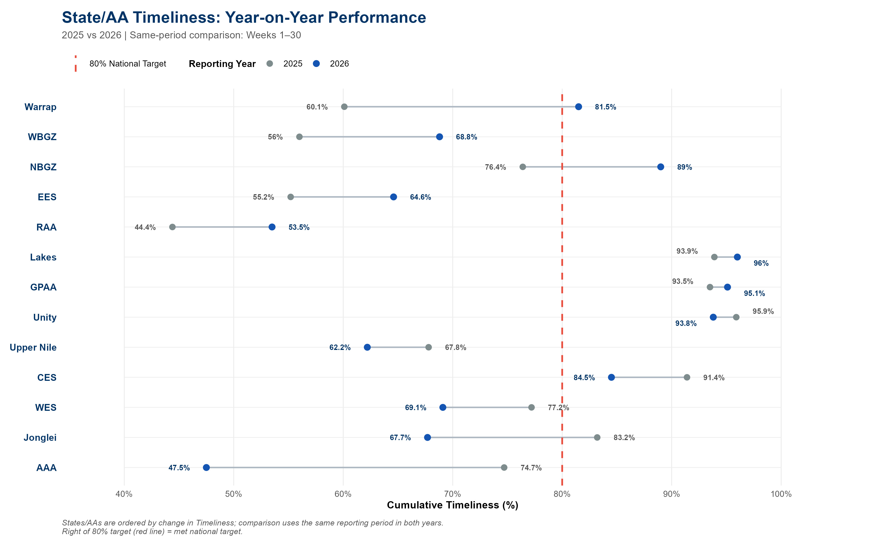</div>
<div class="chart-card"><div class="chart-heading-row"><div><div class="chart-title">State/AA Completeness — Year-on-Year</div><div class="chart-subtitle">Current reporting year compared with the same period of the previous year.</div></div><a class="download-btn" href="Downloads/State_YoY_Completeness.png" download="State_YoY_Completeness.png">Download PNG</a></div>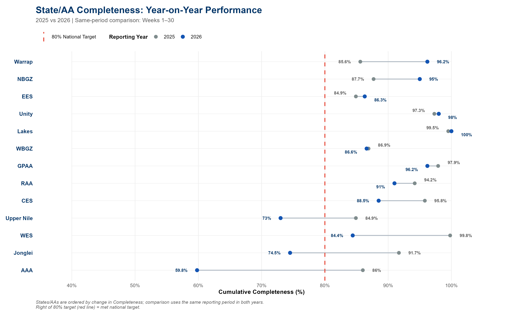</div>
</div>
</div>
<div id="monthly" class="tab-content">
<div class="section-title">
Monthly State/AA Performance
</div>
<div class="section-note">
Monthly performance patterns help identify sustained reporting gaps rather than isolated weekly changes.
</div>
<div class="chart-grid">
<div class="chart-card"><div class="chart-heading-row"><div><div class="chart-title">Monthly Timeliness Heatmap</div><div class="chart-subtitle">State/AA monthly timeliness performance.</div></div><a class="download-btn" href="Downloads/State_Monthly_Timeliness_Heatmap.png" download="State_Monthly_Timeliness_Heatmap.png">Download PNG</a></div>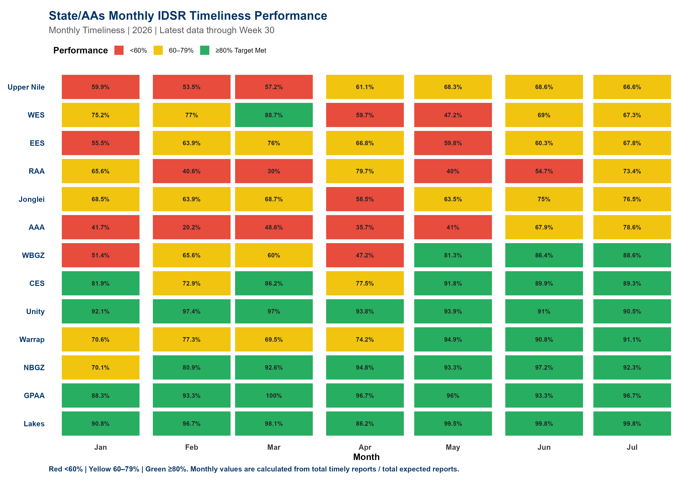</div>
<div class="chart-card"><div class="chart-heading-row"><div><div class="chart-title">Monthly Completeness Heatmap</div><div class="chart-subtitle">State/AA monthly completeness performance.</div></div><a class="download-btn" href="Downloads/State_Monthly_Completeness_Heatmap.png" download="State_Monthly_Completeness_Heatmap.png">Download PNG</a></div>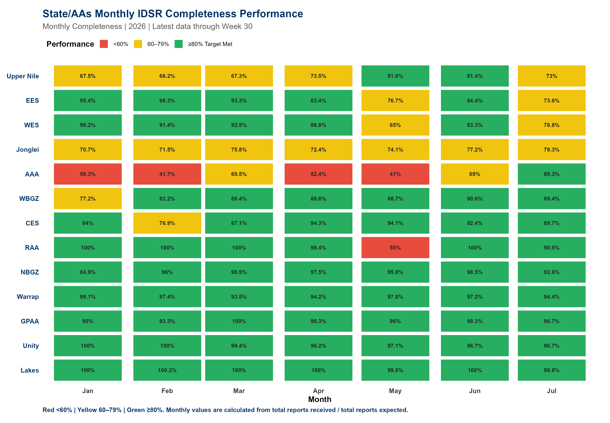</div>
</div>
<div class="table-card">
<div class="table-heading">
<div class="chart-title">
Monthly Comparison Table
</div>
<a class="download-btn" href="Downloads/Monthly_Comparison.csv" download="Monthly_Comparison.csv">Download CSV</a>
</div>
<iframe src="monthly_table.html" 
style="width:100%;height:650px;border:none;">
</iframe>
</div>
</div>
<div id="historical" class="tab-content">
<div class="section-title">
Historical Reporting Performance
</div>
<div class="section-note">
Historical comparisons use the same reporting period where appropriate to support fair comparison.
</div>
<div class="chart-card full-width"><div class="chart-heading-row"><div><div class="chart-title">National Historical Same-Period Comparison</div><div class="chart-subtitle">Historical national performance using the same epidemiological-week period.</div></div><a class="download-btn" href="Downloads/Historical_Same_Period.png" download="Historical_Same_Period.png">Download PNG</a></div>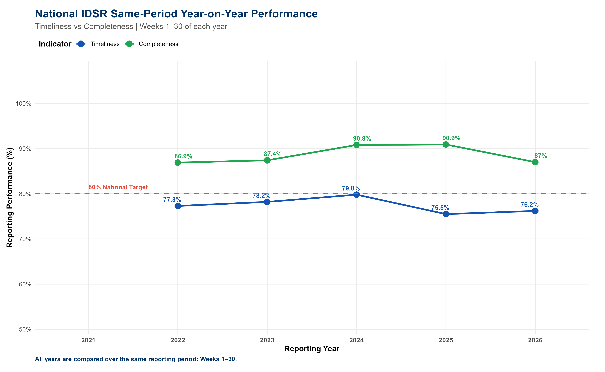</div>
<div class="chart-grid">
<div class="chart-card"><div class="chart-heading-row"><div><div class="chart-title">Historical State/AA Timeliness</div><div class="chart-subtitle">State/AA timeliness performance across available reporting years.</div></div><a class="download-btn" href="Downloads/State_Historical_Timeliness.png" download="State_Historical_Timeliness.png">Download PNG</a></div>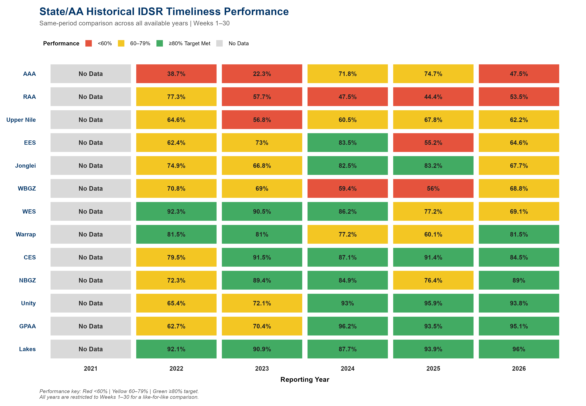</div>
<div class="chart-card"><div class="chart-heading-row"><div><div class="chart-title">Historical State/AA Completeness</div><div class="chart-subtitle">State/AA completeness performance across available reporting years.</div></div><a class="download-btn" href="Downloads/State_Historical_Completeness.png" download="State_Historical_Completeness.png">Download PNG</a></div>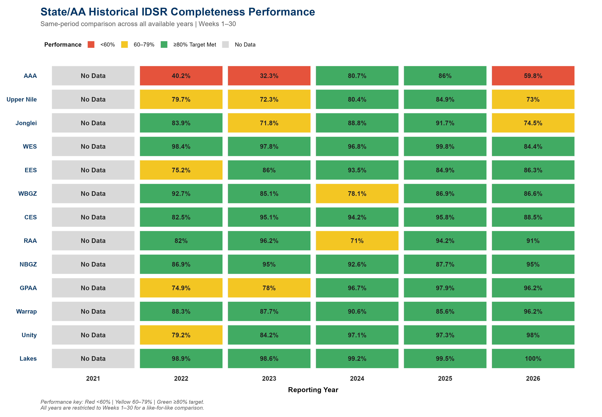</div>
</div>
</div>
<div id="management" class="tab-content">
<div class="section-title">
Management Priority
</div>
<div class="section-note">
Management priority combines current target achievement with historical consistency.
</div>
<div class="chart-card full-width"><div class="chart-heading-row"><div><div class="chart-title">State/AA Management Priority</div><div class="chart-subtitle">Current reporting status and historical consistency for management follow-up.</div></div><a class="download-btn" href="Downloads/State_Management_Priority.png" download="State_Management_Priority.png">Download PNG</a></div></div>
<div class="section-title">
Supporting Tables
</div>
<div class="table-card">
<div class="table-heading">
<div class="chart-title">
Executive Summary Table
</div>
<a class="download-btn" href="Downloads/Executive_Summary.csv" download="Executive_Summary.csv">Download CSV</a>
</div>
<iframe src="executive_table.html" 
style="width:100%;height:720px;border:none;">
</iframe>
</div>
<div class="table-card">
<div class="table-heading">
<div class="chart-title">
State/AA Comparison Table
</div>
<a class="download-btn" href="Downloads/State_AA_Comparison.csv" download="State_AA_Comparison.csv">Download CSV</a>
</div>
<iframe src="state_table.html" 
style="width:100%;height:720px;border:none;">
</iframe>
</div>
<div class="table-card">
<div class="table-heading">
<div class="chart-title">
Management Priority Data
</div>
<a class="download-btn" href="Downloads/Management_Priority.csv" download="Management_Priority.csv">Download CSV</a>
</div>
<p style="font-size:12px;color:#64748b;">
Download the management-priority dataset for additional review, presentation or follow-up.
</p>
</div>
</div>
<div class="footer"><strong>Source:</strong> South Sudan IDSR Reporting Data &nbsp; | &nbsp; <strong>Reporting period:</strong> Epidemiological Weeks 1–30, 2026 &nbsp; | &nbsp; <strong>Target:</strong> ≥80%<br>Ministry of Health, Republic of South Sudan &nbsp; | &nbsp; World Health Organization — South Sudan</div>
<script>
function openTab(evt, tabName) {
  var i;
  var tabcontent;
  var tabbuttons;
  tabcontent = document.getElementsByClassName("tab-content");
  for (i = 0; i < tabcontent.length; i++) {
    tabcontent[i].classList.remove("active");
  }
  tabbuttons = document.getElementsByClassName("tab-button");
  for (i = 0; i < tabbuttons.length; i++) {
    tabbuttons[i].classList.remove("active");
  }
  document.getElementById(tabName).classList.add("active");
  evt.currentTarget.classList.add("active");
  window.scrollTo({
    top: 0,
    behavior: "smooth"
  });
}
</script>
